# AegisAI: Unified AI Governance Platform for Banking


---

## 📋 Table of Contents

1. [Executive Summary](#executive-summary)
2. [The Problem](#the-problem)
3. [Our Solution](#our-solution)
4. [Core Platform Features](#core-platform-features)
5. [System Architecture](#system-architecture)
6. [Competitive Analysis](#competitive-analysis)
7. [Market Validation](#market-validation)
8. [Why Buy vs Build](#why-buy-vs-build)
9. [Implementation Roadmap](#implementation-roadmap)
10. [Demo Plan](#demo-plan)
11. [Team & Ask](#team--ask)

---

## 🎯 Executive Summary

**AegisAI** is the first AI governance platform that **prevents failures before they happen** through behavioral contracts, adversarial resilience testing, and automated remediation—while ensuring continuous regulatory compliance.

Unlike traditional monitoring tools that react to failures, AegisAI proactively controls AI system behavior through enforceable contracts, automated incident response, and cross-system risk propagation analysis.

**Target Market:** Banks deploying ML models and LLM systems requiring unified governance  
**Problem Size:** $2.3M average cost per AI incident (Gartner 2024), 73% of banks lack unified AI governance (McKinsey 2024)  
**Competitive Advantage:** 8 unique features no competitor offers


---

## 🚨 The Problem

### Current State: Fragmented and Reactive

Banks are rapidly deploying AI systems across critical operations:
- **Traditional ML Models:** Credit risk, fraud detection, underwriting, compliance scoring
- **LLM Systems:** Customer explanations, document analysis, support automation, decision assistance

**Critical Gap:** These systems are monitored independently with reactive tools that only alert AFTER failures occur.

```mermaid
graph TD
    subgraph "Current Fragmented Approach"
        ML1[ML Model 1<br/>Credit Risk] --> M1[Monitor 1<br/>DataRobot]
        ML2[ML Model 2<br/>Fraud Detection] --> M2[Monitor 2<br/>Custom Scripts]
        LLM1[LLM System<br/>Explanations] --> M3[Monitor 3<br/>LangSmith]
        LLM2[LLM System<br/>Support] --> M4[Monitor 4<br/>Manual Review]
    end
    
    M1 -.->|No Communication| M2
    M2 -.->|No Communication| M3
    M3 -.->|No Communication| M4
    
    ML1 -->|Drift| X1[❌ Failure]
    X1 -->|Cascades to| LLM1
    LLM1 -->|Wrong Explanations| X2[❌ Customer Impact]
    
    M1 -->|Alert Sent| H[Human Team]
    H -->|15 Hours Later| R[Manual Fix]
    
    style X1 fill:#ff6b6b,stroke:#c92a2a,color:#fff
    style X2 fill:#ff6b6b,stroke:#c92a2a,color:#fff
    style H fill:#ffd43b,stroke:#fab005,color:#000
```



### Real-World Consequences

#### 1. Undetected Cross-System Failures
- ML model drift → LLM generates incorrect explanations → Customer misinformation
- No tool tracks how failures propagate between systems

#### 2. Reactive Monitoring
- Alerts sent after damage is done
- Manual incident response takes hours
- No automated remediation

#### 3. Compliance Nightmares
- Basel III, EU AI Act, SR 11-7 require continuous governance
- Manual compliance tracking is error-prone
- Audit failures result in regulatory penalties

#### 4. No Behavioral Verification
- Statistical metrics (accuracy, latency) miss behavioral degradation
- LLM explanations never verified against model reality
- Adversarial vulnerabilities unknown until exploited

### 💰 The Cost

| Impact Area | Cost |
|-------------|------|
| **Average AI Incident Loss** | $2.3M per incident |
| **Incident Response Time** | 15+ hours average |
| **AI Project Failure Rate** | 40% due to governance gaps |
| **Regulatory Penalties** | $500K+ average per violation |
| **Manual Compliance Cost** | $200K+ per year per bank |

**Source:** Gartner 2024, McKinsey 2024, Federal Reserve SR 11-7 Analysis

---

## 💡 Our Solution: AegisAI Platform

```mermaid
graph TB
    subgraph "Banking AI Systems"
        ML[ML Models<br/>Credit, Fraud, Risk]
        LLM[LLM Systems<br/>Explanations, Support]
    end
    
    subgraph "AegisAI Governance Layer"
        direction LR
        BC[Behavioral<br/>Contracts]
        TE[Trust<br/>Engine]
        RP[Risk<br/>Propagation]
        IP[Incident<br/>Playbooks]
    end
    
    subgraph "Intelligence Layer"
        AT[Adversarial<br/>Testing]
        EC[Explainability<br/>Verification]
        TF[Temporal<br/>Fingerprinting]
    end
    
    subgraph "Automation Layer"
        CA[Compliance<br/>Autopilot]
        CF[Counterfactual<br/>Testing]
        BM[Benchmarking]
    end
    
    ML --> BC
    LLM --> BC
    BC --> TE
    TE --> RP
    RP --> IP
    
    TE --> AT
    TE --> EC
    TE --> TF
    
    IP --> CA
    IP --> CF
    CA --> BM
    
    IP -->|15 Seconds| FIX[✅ Auto-Remediation]
    
    style BC fill:#0ea5e9,stroke:#0284c7,color:#fff
    style TE fill:#8b5cf6,stroke:#7c3aed,color:#fff
    style IP fill:#10b981,stroke:#059669,color:#fff
    style FIX fill:#22c55e,stroke:#16a34a,color:#fff
```



AegisAI shifts AI governance from **reactive monitoring** to **proactive control** through three core innovations:

### 🔐 1. Behavioral Contracts (Not Just Monitoring)

Every AI system registers a **Model Contract** before deployment:

```yaml
model_id: credit_risk_v2
owner: ml_ops_team
risk_classification: high
deployment_date: 2024-01-15

behavioral_contract:
  decision_boundaries:
    - "Must not approve loans > $500K without human review"
    - "Must not reject based solely on age or gender"
  
  autonomy_level: human_on_loop
  
  acceptable_thresholds:
    drift_psi: 0.2
    min_confidence: 0.85
    max_bias_score: 0.15
    accuracy_floor: 0.90
  
  escalation_requirements:
    - "Trust score < 60 → Require approval for high-risk decisions"
    - "Trust score < 40 → Activate kill-switch"
```

**Differentiation:** Contracts are **enforced**, not just documented. Violations block predictions.

### ⚡ 2. Automated Incident Response (Not Just Alerts)

When failures detected, **Incident Playbooks** auto-execute:

```yaml
playbook: high_drift_detected
trigger:
  drift_severity: high
  trust_score: < 60

actions:
  immediate:
    - reduce_autonomy: "approval_required"
    - activate_shadow_model: "credit_risk_v1_backup"
    - notify: ["ml-ops-team", "risk-officer"]
    - freeze_model_updates: true
  
  within_15min:
    - compare_shadow_vs_production: true
    - generate_drift_analysis_report: true
  
  within_1hour:
    - initiate_retraining_pipeline: true
    - schedule_model_review: "next_business_day"
  
  documentation:
    - create_incident_record: true
    - update_audit_trail: true
    - notify_compliance_team: true
```

**Differentiation:** Reduces incident response from **15 hours to 15 seconds**.

### 🕸️ 3. Cross-System Risk Intelligence (Not Isolated Metrics)

**Risk Propagation Graph** models dependencies:

```
ML Credit Model (drift detected)
    ↓ (feeds predictions to)
LLM Explanation System (generates wrong explanations)
    ↓ (misleads)
Customer Decisions (poor experience, complaints)
    ↓ (triggers)
Regulatory Review (compliance violation)
```

**Differentiation:** Only platform that models **cascading AI failures**.

---

## 🔧 Core Platform Features

### Foundation Layer (What Competitors Have)

#### 1. Model Contract Registry
- Pre-deployment registration with behavioral specifications
- Decision boundary enforcement
- Risk classification and autonomy levels
- Escalation requirement definitions

#### 2. Behavioral Baseline Engine
- Learns normal behavior patterns beyond statistical metrics
- Detects behavioral deviations (confidence patterns, response structures)
- Temporal stability tracking
- Silent failure detection

#### 3. Dynamic Trust & Autonomy Engine
- Real-time trust scoring: `Trust = f(drift, accuracy, bias, overrides)`
- Automated autonomy control:
  - **Fully Autonomous** (trust ≥ 80): No intervention
  - **Human-on-Loop** (60-79): Monitored operation
  - **Approval Required** (40-59): Human approval for high-risk
  - **Kill-Switch** (< 40): All decisions blocked
- Proactive control, not reactive alerts

#### 4. Cross-System Risk Propagation
- Dependency graph between ML models, LLMs, and business logic
- Cascading failure prediction
- Impact analysis for governance decisions
- System-level reasoning

#### 5. Human-in-Loop Arbitration
- Approval workflow tracking
- Override pattern analysis
- Intervention effectiveness metrics
- Measurable governance

---

### Intelligence Layer (What Makes Us Unique)

#### 6. Adversarial Resilience Testing ⭐ NEW
**Problem:** Banks don't know if AI systems can withstand attacks until they're attacked.

**Solution:** Continuous adversarial probing on shadow traffic:
- Boundary attacks (test decision boundaries)
- Feature perturbation (input manipulation)
- Confidence gaming (score manipulation attempts)
- Fairness attacks (bias exploitation)

**Metrics:**
- Adversarial Robustness Score (ARS): 0-100
- Attack Surface Area quantification
- Vulnerability detection and remediation

**Value:** Prevents fraud before it happens, quantifies security posture

---

#### 7. Explainability Consistency Monitoring ⭐ NEW
**Problem:** LLMs generate explanations for ML predictions, but nobody verifies accuracy.

**Solution:** Explanation-Prediction Alignment verification:

```python
# LLM says: "High income was the primary approval factor"
llm_explanation = "approved due to high income"

# But model actually used:
actual_importance = {
    "credit_history": 0.45,  # Primary factor
    "income": 0.15,          # Secondary factor
    "age": 0.12
}

# Detect hallucination
alignment_score = 0.35  # Low alignment!
alert = "LLM explanation contradicts model behavior"
```

**Metrics:**
- Explanation Alignment Score
- Hallucination Rate
- Consistency over time

**Value:** Prevents customer misinformation, regulatory violations

---

#### 8. Temporal Behavior Fingerprinting ⭐ NEW
**Problem:** Models degrade slowly in ways statistical tests miss.

**Solution:** Time-series behavioral fingerprints detect subtle anomalies:
- Confidence distribution evolution
- Prediction pattern changes
- Feature usage shifts
- Temporal clustering detection

**Example Detection:**
```
Anomaly: Confidence Creep
- Baseline: mean=0.87, std=0.08
- Current: mean=0.94, std=0.04
- Diagnosis: Model becoming overconfident
- Action: Recalibrate confidence scores
```

**Value:** Catches slow degradation other tools miss

---

#### 9. Multi-Model Ensemble Governance ⭐ NEW
**Problem:** Banks run multiple models for same task, but no tool governs them collectively.

**Solution:** Ensemble-aware monitoring:
- Disagreement detection (models voting differently)
- Dominance alerts (one model overriding others)
- Diversity scoring
- Voting pattern stability

**Value:** Prevents ensemble failures, improves prediction quality

---

### Automation Layer (What Saves Time & Money)

#### 10. Automated Incident Playbooks ⭐ NEW
**Problem:** Manual incident response takes hours.

**Solution:** Pre-configured playbooks that auto-execute:
- Shadow model activation
- Autonomy reduction
- Team notification
- Retraining pipeline triggers
- Audit documentation

**Value:** 15 hours → 15 seconds response time

---

#### 11. Regulatory Compliance Autopilot ⭐ NEW
**Problem:** Manual compliance tracking is slow and error-prone.

**Solution:** Automated verification against regulatory frameworks:
- Basel III compliance checking
- EU AI Act requirements
- SR 11-7 (Federal Reserve) validation
- GDPR adherence verification

**Features:**
- Real-time compliance dashboard
- Auto-generated audit trails
- Violation alerts with remediation guidance
- Evidence collection for audits

**Value:** 70% reduction in compliance costs, zero audit failures

---

#### 12. Counterfactual Governance Testing ⭐ NEW
**Problem:** Can't test governance policies without production impact.

**Solution:** Replay historical decisions with different policies:

```python
scenario = "stricter_approval_policy"
changes = {
    "approval_threshold": 0.75,  # Was 0.70
    "require_human_approval": "risk > medium"
}

# Replay last 30 days
results = simulate(scenario, replay_period="30_days")

# Compare outcomes
original: 6500 approvals, 3% default rate
counterfactual: 5800 approvals, 1.8% default rate
recommendation: "40% risk reduction, 9% revenue impact"
```

**Value:** Risk-free policy optimization

---

### Insights Layer (What Provides Competitive Intelligence)

#### 13. Cross-Institution Benchmarking ⭐ NEW
**Problem:** Banks don't know if their governance is better or worse than peers.

**Solution:** Anonymous benchmarking network:
- Submit anonymized metrics (zero-knowledge proofs)
- Compare against peer averages
- Identify governance gaps
- Discover best practices

**Example Insights:**
```
Your trust score: 78 (65th percentile)
Your drift detection: Faster than 80% of peers
Your compliance: Below average (94 vs 96)
Recommendation: Improve LLM monitoring
```

**Value:** Competitive intelligence without data sharing


---

## 🏗️ System Architecture

### High-Level Architecture


### Data Flow Architecture


---

## 🥊 Competitive Analysis

### Feature Comparison Matrix

| Feature | DataRobot | Arize AI | Fiddler | WhyLabs | **AegisAI** |
|---------|-----------|----------|---------|---------|-------------|
| **Foundation** |
| ML Monitoring | ✅ | ✅ | ✅ | ✅ | ✅ |
| LLM Monitoring | ❌ | ✅ | ✅ | ✅ | ✅ |
| Drift Detection | ✅ | ✅ | ✅ | ✅ | ✅ |
| **Unique to AegisAI** |
| Behavioral Contracts | ❌ | ❌ | ❌ | ❌ | ✅ |
| Cross-System Risk Propagation | ❌ | ❌ | ❌ | ❌ | ✅ |
| Automated Incident Playbooks | ❌ | ❌ | ❌ | ❌ | ✅ |
| Adversarial Resilience Testing | ❌ | ❌ | ⚠️ | ❌ | ✅ |
| Explainability Verification | ❌ | ❌ | ❌ | ❌ | ✅ |
| Regulatory Compliance Autopilot | ❌ | ❌ | ❌ | ❌ | ✅ |
| Ensemble Governance | ❌ | ❌ | ❌ | ❌ | ✅ |
| Counterfactual Testing | ❌ | ❌ | ❌ | ❌ | ✅ |
| Cross-Institution Benchmarking | ❌ | ❌ | ❌ | ❌ | ✅ |
| **Control** |
| Automated Kill-Switch | ❌ | ❌ | ❌ | ❌ | ✅ |
| Dynamic Autonomy Levels | ❌ | ❌ | ❌ | ❌ | ✅ |
| **Pricing** |
| Starting Price | $50K+/year | $30K+/year | $40K+/year | $25K+/year | $200K/year |

**AegisAI Advantage:** 8 unique features that shift from monitoring to control


---

## 📊 Market Validation

### Problem Validation

**Primary Research:**
- ✅ Interviewed 12 ML ops engineers at 5 major banks
- ✅ Key pain point: *"We have 8 different monitoring tools, none talk to each other"*
- ✅ Compliance officers: *"Manual audit prep takes 200 hours per quarter"*
- ✅ Risk officers: *"We don't know when one AI failure will cascade to others"*

**Secondary Research:**
- 📊 **73% of banks** lack unified AI governance (McKinsey 2024)
- 📊 **$2.3M average loss** per AI incident (Gartner 2024)
- 📊 **40% of AI projects fail** due to governance gaps (Forrester 2024)
- 📊 **$500K+ average penalty** for compliance violations (Federal Reserve 2023)

### Solution Validation

**Prototype Testing:**
- ✅ Showed early prototype to 3 banks
- ✅ Feedback: *"Behavioral contracts solve our biggest governance gap"*
- ✅ Interest: 2 banks requested pilot program
- ✅ Validation: *"This is the missing piece between monitoring and control"*

### Market Signals


**Key Drivers:**
1. **EU AI Act (2025 deadline)** - Banks must demonstrate AI governance
2. **Basel III** - Requires continuous model validation
3. **Federal Reserve SR 11-7** - Model risk management guidance
4. **GDPR** - Right to explanation for automated decisions

**Market Size:**
- **TAM:** $5B (AI governance tools for financial services)
- **SAM:** $1.2B (Banking AI governance)
- **SOM:** $120M (Top 100 banks, Year 3)

---

## 🏢 Why Buy vs Build

### The Build vs Buy Analysis

| Factor | Build Internally | Buy AegisAI |
|--------|------------------|-------------|
| **Time to Market** | 18-24 months | 3 months (pilot) |
| **Development Cost** | $2M+ (10 engineers × 18 months) | $200K/year subscription |
| **Regulatory Expertise** | Hire compliance specialists | Included (we track regulations) |
| **Maintenance** | Ongoing team required | Included in subscription |
| **Innovation** | Stagnates after v1 | Continuous feature updates |
| **Network Effects** | Isolated | Cross-institution benchmarking |
| **Vendor Neutrality** | Locked to internal stack | Works with any ML platform |
| **Opportunity Cost** | Engineers not building revenue features | Zero opportunity cost |

### Why Banks Will Buy (Not Build)

#### 1. 🌐 Network Effects
**Cross-institution benchmarking** requires multi-bank participation. A single bank can't build this alone.

#### 2. ⚖️ Regulatory Expertise
We track Basel III, EU AI Act, SR 11-7, GDPR changes **full-time**. Banks would need dedicated compliance team.

#### 3. ⏰ Time to Market
**EU AI Act compliance deadline is 2025** - no time to build internally. Banks need governance NOW.

#### 4. 🔌 Vendor Neutrality
Works with **any ML platform**: DataRobot, SageMaker, Azure ML, Google Vertex, custom models.

Internal tools create vendor lock-in.

#### 5. 🚀 Continuous Innovation
We add new governance features quarterly. Internal teams maintain legacy code.

#### 6. 💰 ROI Analysis


**Bottom Line:** Building costs **$2M+ over 18 months**. Buying costs **$200K/year** with immediate value.

---
