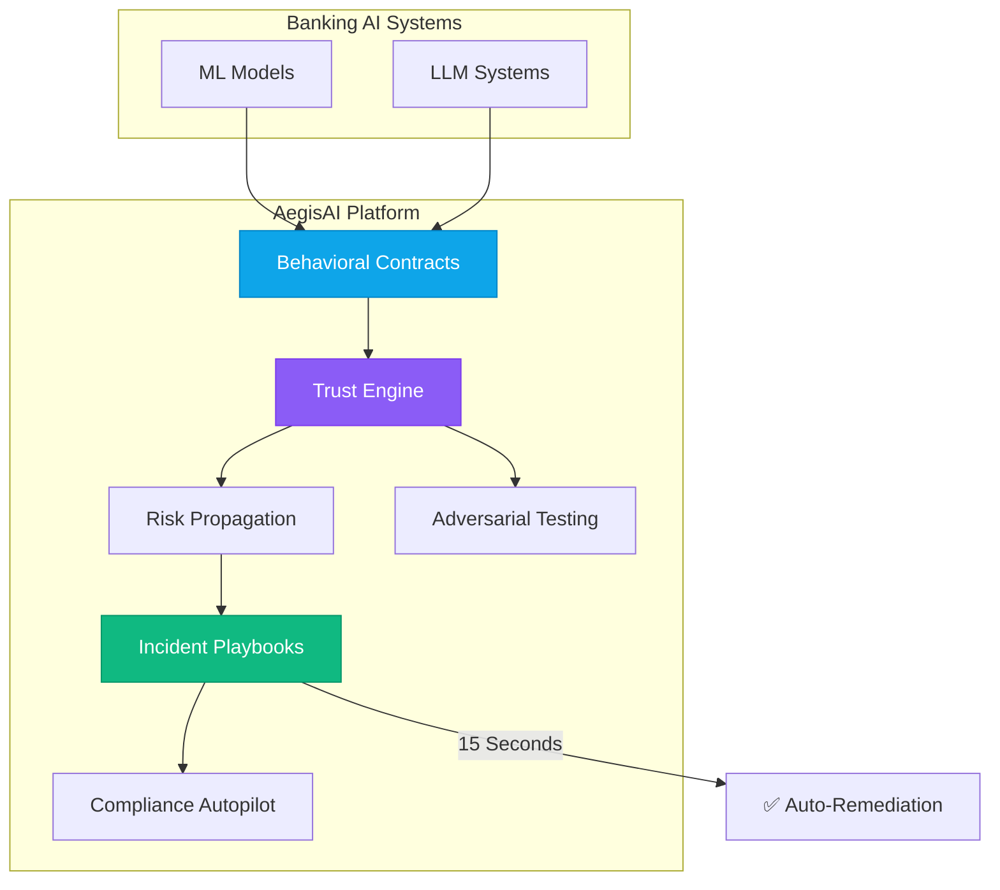

# AegisAI - Unified AI Governance Platform for Banking

<div align="center">


**The first AI governance platform that prevents failures before they happen**

[🚀 Live Demo](https://aegis-ai-eight.vercel.app/) • [📖 Documentation](#documentation) • [🎯 Features](#features) • [🏗️ Architecture](#architecture) • [👥 Team](#team)

</div>

---

## 🎯 Overview

**AegisAI** shifts AI governance from **reactive monitoring** to **proactive control** through behavioral contracts, adversarial resilience testing, and automated remediation—while ensuring continuous regulatory compliance.

### The Problem We Solve

Banks deploy 50+ AI models and LLM systems, but current monitoring tools only alert **AFTER** failures occur:
- 💸 **$2.3M** average loss per AI incident
- ⏰ **15+ hours** manual incident response time
- 📊 **73%** of banks lack unified AI governance
- ⚖️ **$500K+** average regulatory penalty

### Our Solution

AegisAI provides **8 unique features** no competitor offers:
1. ✅ Behavioral Contracts with enforcement
2. ✅ Automated Incident Playbooks (15 sec response)
3. ✅ Cross-System Risk Propagation tracking
4. ✅ Adversarial Resilience Testing
5. ✅ Explainability Consistency Verification
6. ✅ Regulatory Compliance Autopilot
7. ✅ Counterfactual Governance Testing
8. ✅ Cross-Institution Benchmarking

---

## ✨ Key Features

### 🔐 Foundation Layer

#### Model Contract Registry
Every AI system registers a behavioral contract before deployment:
```yaml
model_id: credit_risk_v2
risk_classification: high
autonomy_level: human_on_loop
thresholds:
  drift_psi: 0.2
  min_confidence: 0.85
  accuracy_floor: 0.90
```

#### Dynamic Trust Engine
Real-time trust scoring with automated autonomy control:
- **Fully Autonomous** (≥80): No intervention
- **Human-on-Loop** (60-79): Monitored operation
- **Approval Required** (40-59): Human approval needed
- **Kill-Switch** (<40): All decisions blocked

### 🧠 Intelligence Layer

#### Adversarial Resilience Testing
Continuous security probing on shadow traffic:
- Boundary attacks
- Feature perturbation
- Confidence gaming detection
- Fairness attack simulation

#### Explainability Verification
Detects when LLM explanations contradict model behavior:
```python
LLM says: "Approved due to high income"
Reality: Credit history was primary factor (45% vs 15%)
Alert: Explanation hallucination detected ❌
```

### ⚡ Automation Layer

#### Automated Incident Playbooks
Pre-configured responses that execute in **15 seconds**:
1. Activate shadow model
2. Reduce autonomy level
3. Notify teams (email + Slack)
4. Generate compliance report
5. Update audit trail

#### Compliance Autopilot
Automated verification against:
- Basel III
- EU AI Act
- Federal Reserve SR 11-7
- GDPR

---

## 🏗️ Architecture



### Tech Stack

**Backend:**
- Python 3.11+ (FastAPI)
- MongoDB (data storage)
- Redis (caching)
- Celery (async tasks)

**Frontend:**
- React 18+ with TypeScript
- Tailwind CSS
- Recharts (visualizations)
- Framer Motion (animations)

**ML/AI:**
- scikit-learn (drift detection)
- PyTorch (adversarial testing)
- LangChain (LLM integration)
- SHAP (explainability)

**Infrastructure:**
- Docker & Docker Compose
- Kubernetes (production)
- AWS/Azure (cloud)
- Prometheus + Grafana (monitoring)

---

## 🚀 Quick Start

### Prerequisites
- Python 3.11+
- Node.js 18+
- MongoDB 6.0+
- Docker (optional)

### Installation

#### 1. Clone the Repository
```bash
git clone https://github.com/your-org/aegisai.git
cd aegisai
```

#### 2. Backend Setup
```bash
cd model
python -m venv venv
source venv/bin/activate  # On Windows: venv\Scripts\activate
pip install -r requirements.txt

# Configure environment
cp .env.example .env
# Edit .env with your MongoDB URI and API keys

# Start backend
python main.py
```

Backend runs at: `http://localhost:8000`

#### 3. Frontend Setup
```bash
cd Frontend
npm install

# Configure environment
cp .env.example .env
# Edit .env with backend API URL

# Start frontend
npm run dev
```

Frontend runs at: `http://localhost:5173`

#### 4. Using Docker (Recommended)
```bash
# Start all services
docker-compose up -d

# View logs
docker-compose logs -f

# Stop services
docker-compose down
```

---

## 📊 Demo

### 🌐 Live Demo
**Try it now:** [https://aegis-ai-eight.vercel.app/](https://aegis-ai-eight.vercel.app/)

The live demo showcases:
- ✅ Real-time trust score monitoring
- ✅ Data drift detection dashboard
- ✅ Risk propagation visualization
- ✅ Model health metrics
- ✅ LLM observability panel
- ✅ Incident simulation controls

### Incident Response Demo

1. **Normal Operation**
   - All systems healthy
   - Trust score: 85 (Fully Autonomous)

2. **Trigger Drift Incident**
   ```bash
   curl -X POST http://localhost:8000/simulation/drift
   ```

3. **Watch Automated Response** (15 seconds)
   - ✅ Shadow model activated
   - ✅ Autonomy reduced to "approval required"
   - ✅ Teams notified
   - ✅ Compliance report generated
   - ✅ Trust score recalculated: 85 → 45

4. **Recovery**
   - Shadow model performs better
   - Trust score recovers: 45 → 70
   - System returns to monitored operation

### API Examples

#### Register Model Contract
```bash
curl -X POST http://localhost:8000/api/contracts \
  -H "Content-Type: application/json" \
  -d '{
    "model_id": "credit_risk_v2",
    "risk_classification": "high",
    "autonomy_level": "human_on_loop",
    "thresholds": {
      "drift_psi": 0.2,
      "min_confidence": 0.85
    }
  }'
```

#### Get Trust Score
```bash
curl http://localhost:8000/governance/trust
```

#### Check Drift
```bash
curl http://localhost:8000/monitoring/drift?hours=24
```

---

## 🎯 Use Cases

### 1. Credit Risk Governance
- Monitor credit scoring models
- Detect drift in applicant demographics
- Verify LLM explanations for loan decisions
- Auto-generate Basel III compliance reports

### 2. Fraud Detection Control
- Test adversarial robustness
- Track ensemble model disagreements
- Automated incident response for anomalies
- Cross-system risk propagation analysis

### 3. Regulatory Compliance
- Continuous EU AI Act verification
- Automated audit trail generation
- Counterfactual policy testing
- Cross-institution benchmarking

---

## 🥊 Competitive Advantage

| Feature | DataRobot | Arize | Fiddler | WhyLabs | **AegisAI** |
|---------|-----------|-------|---------|---------|-------------|
| ML Monitoring | ✅ | ✅ | ✅ | ✅ | ✅ |
| LLM Monitoring | ❌ | ✅ | ✅ | ✅ | ✅ |
| Behavioral Contracts | ❌ | ❌ | ❌ | ❌ | ✅ |
| Automated Playbooks | ❌ | ❌ | ❌ | ❌ | ✅ |
| Adversarial Testing | ❌ | ❌ | ⚠️ | ❌ | ✅ |
| Explainability Verification | ❌ | ❌ | ❌ | ❌ | ✅ |
| Compliance Autopilot | ❌ | ❌ | ❌ | ❌ | ✅ |
| Counterfactual Testing | ❌ | ❌ | ❌ | ❌ | ✅ |
| Cross-Institution Benchmarking | ❌ | ❌ | ❌ | ❌ | ✅ |

**Result:** 8 unique features that shift from monitoring to control

---

## 📁 Project Structure

```
aegisai/
├── model/                      # Backend (Python/FastAPI)
│   ├── main.py                # API entry point
│   ├── ml_model.py            # ML model wrapper
│   ├── governance/            # Trust engine & contracts
│   │   └── trust_engine.py
│   ├── monitoring/            # Drift & performance tracking
│   │   ├── drift_detector.py
│   │   └── performance_tracker.py
│   ├── llm/                   # LLM integration
│   │   └── openrouter_service.py
│   └── config/                # Governance rules
│       └── governance_rules.yaml
│
├── Frontend/                   # Frontend (React/TypeScript)
│   ├── src/
│   │   ├── components/        # React components
│   │   │   └── dashboard/
│   │   ├── pages/             # Page components
│   │   ├── services/          # API client
│   │   └── context/           # React context
│   └── public/
│
├── Backend/                    # Node.js services
│   ├── server.js              # Express server
│   ├── routes/                # API routes
│   └── services/              # Alert services
│       └── alertService.js
│
├── docker-compose.yml         # Docker orchestration
├── README.md                  # This file
└── AEGIS_AI_PROJECT_PROPOSAL.md  # Detailed proposal
```

---

## 👥 Team

<table>
  <tr>
    <td align="center">
      <a href="https://www.linkedin.com/in/utsavsingh35">
        <br />
        <sub><b>Utsav Singh</b></sub>
      </a><br />
      <a href="https://utsavsingh.dev/">🌐 Portfolio</a> •
      <a href="https://github.com/Utsav-Singh-35">💻 GitHub</a><br />
      <a href="mailto:us101741@gmail.com">📧 us101741@gmail.com</a>
    </td>
    <td align="center">
      <a href="https://www.linkedin.com/in/5797omsingh">
        <br />
        <sub><b>Om Singh</b></sub>
      </a><br />
      <a href="https://om07.in/">🌐 Portfolio</a> •
      <a href="https://github.com/Jayom5797">💻 GitHub</a><br />
      <a href="mailto:jayom5797@gmail.com">📧 jayom5797@gmail.com</a>
    </td>
    <td align="center">
      <a href="https://www.linkedin.com/in/1045-vikas-tiwari">
        <br />
        <sub><b>Vikas Tiwari</b></sub>
      </a><br />
      <a href="https://vikas-tiwari.in/">🌐 Portfolio</a> •
      <a href="https://github.com/Cyberexe1">💻 GitHub</a><br />
      <a href="mailto:vikastiwari1045@gmail.com">📧 vikastiwari1045@gmail.com</a>
    </td>
  </tr>
</table>

### Roles & Contributions

**Utsav Singh** - Full Stack Developer & ML Engineer
- Backend architecture (FastAPI, MongoDB)
- ML model integration & drift detection
- Trust engine implementation

**Om Singh** - Frontend Developer & UI/UX Designer
- React dashboard development
- Real-time visualization components
- User experience design

**Vikas Tiwari** - DevOps & Security Engineer
- Docker & Kubernetes setup
- CI/CD pipeline configuration
- Security & compliance implementation

---

## 🗺️ Roadmap

### Phase 1: Foundation (Months 1-3) ✅
- [x] Model Contract Registry
- [x] Trust Engine
- [x] Basic Incident Playbooks
- [x] Dashboard MVP
- [x] API Documentation

### Phase 2: Intelligence (Months 4-6) 🚧
- [ ] Adversarial Testing Engine
- [ ] Explainability Verification
- [ ] Temporal Fingerprinting
- [ ] Pilot with 2 banks

### Phase 3: Automation (Months 7-9) 📅
- [ ] Compliance Autopilot
- [ ] Counterfactual Testing
- [ ] Cross-Institution Benchmarking
- [ ] Production Launch

---

## 📖 Documentation

### API Documentation
- **Swagger UI:** http://localhost:8000/docs
- **ReDoc:** http://localhost:8000/redoc

### Key Endpoints

#### Governance
- `GET /governance/trust` - Get current trust score
- `GET /governance/history` - Trust score history
- `GET /governance/incidents` - List incidents
- `POST /governance/simulate-incident` - Demo mode

#### Monitoring
- `GET /monitoring/drift` - Check data drift
- `GET /monitoring/performance` - Performance metrics
- `GET /monitoring/health` - System health

#### Predictions
- `POST /predict` - Make prediction (with governance)
- `GET /stats` - Prediction statistics

### Configuration

#### Environment Variables
```bash
# Backend (.env)
MONGODB_URI=mongodb://localhost:27017
MONGODB_DATABASE=credit_risk_db
MODEL_PATH=trained_models/credit_model_v1.0.0.joblib
OPENROUTER_API_KEY=your_api_key_here
API_HOST=0.0.0.0
API_PORT=8000

# Frontend (.env)
VITE_API_URL=http://localhost:8000
```

#### Governance Rules
Edit `model/config/governance_rules.yaml` to customize:
- Trust score weights
- Drift thresholds
- Autonomy levels
- Compliance frameworks

---

## 🧪 Testing

### Run Backend Tests
```bash
cd model
pytest tests/ -v
```

### Run Frontend Tests
```bash
cd Frontend
npm test
```

### Integration Tests
```bash
# Start all services
docker-compose up -d

# Run integration tests
pytest tests/integration/ -v
```

---

## 📄 License

This project is licensed under the MIT License - see the [LICENSE](LICENSE) file for details.

---

## 🙏 Acknowledgments

- **Gartner** for AI incident cost research
- **McKinsey** for governance gap analysis
- **Federal Reserve** for SR 11-7 guidance
- **EU AI Act** for regulatory framework

---


## 🌟 Star History

If you find AegisAI useful, please consider giving us a star ⭐

[](https://star-history.com/#your-org/aegisai&Date)

---

<div align="center">

**Built with ❤️ by the AegisAI Team**

[⬆ Back to Top](#aegisai---unified-ai-governance-platform-for-banking)

</div>
